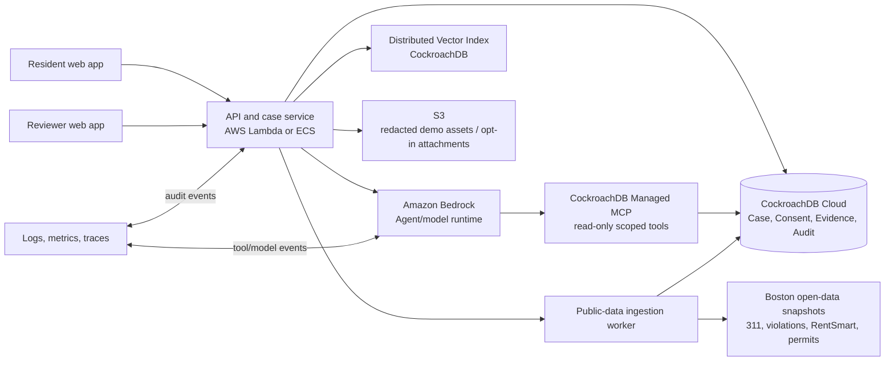
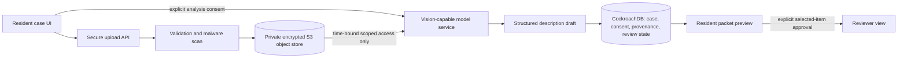

# HomeSafe
## Product Requirements Document and Hackathon Project Proposal

**Project category:** Civic technology, housing stability, agentic AI, open data

**Prepared for:** CockroachDB × AWS Hackathon — *Build with Agentic Memory*

**Prepared by:** Manus AI

**Version:** 1.0 — August 2026

---

## 1. Executive summary

> **HomeSafe is an auditable case-memory agent that turns fragmented housing signals into faster, safer human action—without making a resident repeat their story.**

HomeSafe is a privacy-first, resident-controlled evidence and coordination layer for unsafe rental-housing concerns. It combines address-matched public records—such as 311 service requests, building and property violations, RentSmart, building permits, and property reference data—with a resident’s opt-in private case history. The agent does not make legal determinations, rate landlords, automatically file complaints, or replace inspectors. It remembers what the resident has authorized it to remember, explains its evidence and uncertainty, and prepares a source-cited packet for a human housing navigator or inspector.

The project answers the hackathon’s core challenge directly: **persistent memory is the product**, not a behind-the-scenes database. CockroachDB stores structured case history, consent state, evidence provenance, operational tasks, and an audit trail; its Distributed Vector Index supports semantic retrieval of user-authorized notes and policy guidance; and its Managed MCP Server provides narrowly scoped, grounded access to the system of record. Amazon Bedrock provides the model runtime, while Lambda or ECS hosts the application services. [1]

Boston is an ideal pilot. The City publishes daily 311 data, including a documented transition between a legacy and new system; building and property violations; RentSmart; building permits; property data; and address data. [2] [3] Boston also makes clear that renters are entitled to safe and sanitary housing, including heat, water, adequate exits, working carbon-monoxide and smoke detectors, and freedom from harmful defects and pests. [4] The design generalizes to any city with 311, code-enforcement, permit, and address data.

| Proposal element | HomeSafe response |
|---|---|
| **Real-world impact** | Helps residents organize a persistent, evidence-backed housing concern and helps navigators or inspectors see a verified record faster. |
| **Agentic memory design** | Maintains durable case, semantic, operational, consent, and audit memory—each visible to users and reviewers. |
| **Technical implementation** | Uses CockroachDB MCP, Distributed Vector Indexing, and `ccloud` CLI alongside AWS Bedrock and Lambda/ECS. |
| **Production readiness** | Enforces consent, source provenance, role-based access, human approval gates, encryption, minimal retention, and explicit uncertainty. |
| **Originality** | Goes beyond Boston’s existing OpenContext natural-language data exploration by turning fragmented data into a resident-controlled, longitudinal case workflow. [5] |

---

## 2. The problem and opportunity

### 2.1 Resident problem

A renter with a recurring heat, water, pest, smoke-detector, or unsafe-exit issue faces an exhausting coordination burden. They may describe the same incident to a landlord, city service line, navigator, inspector, or advocate. They may not know whether the condition is urgent, which public records are relevant, what has occurred at the property before, or how to create a credible chronology. The burden falls hardest on residents who face language, accessibility, time, or digital-literacy barriers.

The resident does not need a generic chatbot. They need a tool that remembers the issue and the context **only with their permission**, separates their statements from public facts, and enables the next human action.

### 2.2 Government problem

Housing navigators and inspectors may work across fragmented systems. An individual public record may be visible, but a trusted, time-aware synthesis is often difficult: what was reported before; what is verified; whether work was permitted; which issue remains unresolved; what the resident has consented to share; and what a human should do next. A conventional dashboard can display records but does not retain a consented, evolving case narrative or preserve an agent’s retrieval and recommendation trail.

### 2.3 Why Boston and why now

Boston’s open-data portal offers the data building blocks for a safe prototype. Its 311 dataset includes all channels through which requests are created and is updated daily; the City warns that 311 is migrating to a new data system and the schemas must be handled carefully during the transition. [2] The portal’s RentSmart dataset combines BOS:311 and Inspectional Services information to help prospective tenants develop a more complete picture of Boston homes and apartments. [3] Building permits are available from 2009 onward, but issued permits do not prove that a particular housing problem has been fixed. [6]

OpenContext already enables natural-language exploration of Analyze Boston datasets through an MCP-based approach. [5] HomeSafe therefore avoids competing as “another interface for asking questions.” It creates a different category: **case memory with consent, operational state, source provenance, and human review.**

---

## 3. Product vision, positioning, and boundaries

### 3.1 Vision

Every renter should be able to carry forward a coherent, private, and source-backed account of a housing-safety concern. Every authorized city helper should be able to understand that account quickly, while seeing exactly which parts are public record, resident statements, or system-generated inferences.

### 3.2 Positioning

HomeSafe is a **resident-controlled evidence and coordination layer**. It is not a landlord-rating product, a legal-advice bot, an automated enforcement system, or a predictive risk score for individual people or property owners.

The project should be described consistently as follows:

> HomeSafe helps a resident tell their story once, retain control of it, connect it to relevant public facts, and prepare the next human conversation.

### 3.3 Explicit non-goals

| Out of scope | Reason |
|---|---|
| Legal advice, liability determinations, or representation | The application lacks the authority and context to provide legal conclusions. |
| Publishing owner, tenant, or building scores | Scores can amplify errors, create fairness risks, and conflict with the product’s evidence-first purpose. |
| Auto-submitting 311 reports, enforcement actions, notices, or emails | High-impact external actions require a person’s review and affirmative authorization. |
| Diagnosing housing conditions from photographs | The MVP accepts notes or demo assets but does not classify images as proof of a code violation. |
| Scraping private or paywalled records | The MVP relies on documented public sources and user-provided information only. |
| Using private notes for aggregate analytics without clear consent | Private content must remain private by default. |

---

## 4. Target users and stakeholders

| Persona | Situation | Primary job to be done | HomeSafe value |
|---|---|---|---|
| **Maya, renter** | Her apartment’s heat is intermittent. She has reported it before and is tired of starting from zero. | Understand the situation and prepare a credible next step. | A persistent private case, simple plan, source-cited timeline, and shareable packet. |
| **Jordan, housing navigator** | Supports many residents and must quickly see what is known, consented, and unresolved. | Triage the case without requesting the same information repeatedly. | A concise evidence packet, explicit provenance, and approved handoff context. |
| **Casey, inspector or supervisor** | Reviews a property’s public records and decides what staff should investigate. | Assess public context and identify the correct human action. | An address-centered timeline with record links, caveats, and a transparent case status. |
| **City program lead** | Wants systemic visibility without exposing resident narratives. | Spot service gaps and response bottlenecks. | Aggregated, privacy-preserving counts and response-time patterns; not individual profiling. |

### Accessibility and equity requirements

The MVP should support clear plain-language English, a high-contrast interface, keyboard navigation, and a language-preference field that the system remembers only with consent. It should be useful even if a resident has little familiarity with city terminology. The agent must ask short, non-leading questions and never assume immigration status, family composition, income, disability, health status, or a legal conclusion.

---

## 5. Product scope and MVP

### 5.1 Hackathon MVP thesis

The MVP demonstrates one complete journey for a simulated concern: **“My apartment has no heat, and I have reported it before.”** The proof is not the volume of data or number of features. The proof is that the agent reliably carries context across sessions, retrieves relevant and cited public evidence, recognizes what it does not know, and prepares a human-reviewable next step.

### 5.2 In-scope MVP capabilities

| Capability | Description | Priority |
|---|---|---:|
| Create private case | Enter address, choose issue category, add a short description, select language preference, and set sharing preferences. | Must-have |
| Resolve and normalize address | Match an entered address to a canonical address record and show match confidence. | Must-have |
| Build public timeline | Retrieve address-matched public events: relevant 311, violations, permits, and property/RentSmart context. | Must-have |
| Remember across sessions | Persist notes, preferences, retrieved evidence, and unresolved questions; show delta since last session. | Must-have |
| “Why I remember this” panel | For every summary or recommendation, display source record(s), consent state, timestamps, memory type, and confidence/caveat. | Must-have |
| Generate cited evidence packet | Produce a plain-language resident summary and a staff-ready factual packet with linked sources. | Must-have |
| Human approval gate | Require resident confirmation before sharing a packet and staff confirmation before a status/action note is recorded. | Must-have |
| Staff review mode | Provide a minimal reviewer console for the preloaded demo case. | Must-have |
| Reminder/task state | Record a follow-up date and show pending human action. | Should-have |
| Aggregate program view | Show counts of synthetic or public cases by issue type without exposing private notes. | Stretch |
| Multilingual output | Support at least one extra language via Bedrock, with English source citations retained. | Stretch |

### 5.3 The visible memory moment

A particularly strong feature is a visible **“Why I remember this”** panel. This panel makes the CockroachDB memory layer visible and credible rather than hidden infrastructure.

| Panel element | Example shown in demo | User benefit |
|---|---|---|
| Memory statement | “You reported intermittent heat on Aug. 10.” | Confirms what the system retained. |
| Memory type | Resident-provided private note. | Separates the resident’s statement from public fact. |
| Consent state | Private to you; not shared with a reviewer. | Makes control visible. |
| Timestamp | Added Aug. 10, 6:42 p.m.; last reviewed Aug. 12. | Establishes temporal context. |
| Supporting sources | 311 request ID, public record date, city data URL. | Enables verification. |
| Caveat/confidence | “Address matched with high confidence. This permit does not establish that heat was restored.” | Prevents misleading inference. |
| Retrieval reason | “Used because your current concern is semantically related to your earlier ‘cold apartment’ note.” | Makes vector retrieval explainable. |

---

## 6. User journeys and functional requirements

### 6.1 Journey A: Resident opens a housing-safety case

**Trigger:** Maya visits HomeSafe after experiencing no heat.

**Flow:** She enters an address; the application offers a canonical match; she selects “heat or hot water” and describes the concern. The agent asks only necessary follow-up questions, such as whether the situation is an emergency. It then creates a private case, searches eligible public data, and displays a timeline separated into public records, Maya’s private notes, and agent-generated summaries.

**Acceptance criteria:**

| ID | Requirement | Acceptance criterion |
|---|---|---|
| FR-01 | Address entry and match | A user can select from normalized address candidates. The application displays match confidence and does not silently overwrite the entered address. |
| FR-02 | Case creation | A case receives a unique ID, status, issue category, created timestamp, and consent profile in the database. |
| FR-03 | Data segregation | Private notes are never displayed in public-record timeline sections or reviewer views unless the user explicitly grants sharing consent. |
| FR-04 | Emergency handling | If the user describes an immediate emergency, the system displays a prominent human emergency guidance message and does not pretend to resolve the emergency. |
| FR-05 | Evidence labels | Every timeline item is visibly labeled **Public record**, **Resident statement**, or **Agent inference**. |

### 6.2 Journey B: Resident returns two days later

**Trigger:** Maya returns and says, “The heat is still out; what changed?”

**Flow:** The agent loads case state, retrieves new data snapshots where available, compares current evidence with the last reviewed set, and provides a short delta: “Your note is still private. One public record was retrieved since your last visit. No data in the source establishes the condition has been resolved.” The “Why I remember this” panel exposes the exact memory records and retrieval rationale.

**Acceptance criteria:**

| ID | Requirement | Acceptance criterion |
|---|---|---|
| FR-06 | Session continuity | The agent can retrieve the resident’s earlier authorized note and preferences using the case ID and authenticated user identity. |
| FR-07 | Change detection | The system compares a stored evidence snapshot with newly retrieved records and labels additions, removals, and unchanged items. |
| FR-08 | Explanation | The agent’s answer includes record citations and a `why_remembered` explanation for each significant retrieved memory. |
| FR-09 | No false resolution | The agent must not claim a condition was fixed merely because a permit exists or a public record is absent. |

### 6.3 Journey C: Resident shares a packet with a navigator

**Trigger:** Maya chooses “Prepare a summary for a housing navigator.”

**Flow:** The application previews the packet, lists every private item included, and asks Maya to approve the specific share. Once approved, the system generates an immutable packet version. Jordan sees the packet, the public-record timeline, consent scope, and a recommendation for a human follow-up; Jordan can record a review outcome, but the system cannot automatically contact a landlord or take enforcement action.

**Acceptance criteria:**

| ID | Requirement | Acceptance criterion |
|---|---|---|
| FR-10 | Granular consent | The resident chooses which private notes or attachments to include; the default is share nothing private. |
| FR-11 | Immutable packet | A shared packet version stores its included event IDs, generated content, sources, creator, and timestamp. |
| FR-12 | Reviewer visibility | A reviewer sees consent scope and provenance before opening private content. |
| FR-13 | Approval gate | External delivery/export actions remain disabled until the resident explicitly confirms sharing. |
| FR-14 | Review trace | Reviewer comments and status updates are stored with an actor ID and timestamp. |

### 6.4 Journey D: City staff reviews a recurring pattern

**Trigger:** A reviewer opens an authorized case.

**Flow:** The reviewer sees a chronological public-record view of the address and a separate panel with resident-consented notes. The system highlights a non-diagnostic pattern: “Multiple relevant public events appear in this timeline.” It links the raw records and clearly states that the pattern is not a legal or code conclusion.

**Acceptance criteria:**

| ID | Requirement | Acceptance criterion |
|---|---|---|
| FR-15 | Evidence-first patterning | Pattern language must link to underlying source event IDs and use calibrated wording such as “appears” or “may warrant review.” |
| FR-16 | Human decision required | The system may suggest a review checklist but cannot set enforcement status, issue citations, or close a case. |
| FR-17 | Role enforcement | A resident cannot access a reviewer queue; a reviewer cannot access private cases lacking explicit sharing consent. |

---

## 7. Data strategy and canonical model

### 7.1 Data inputs

| Source | Use in HomeSafe | Data freshness and caveat |
|---|---|---|
| Boston 311 Service Requests | Relevant public service-history events by address, date, type, and status. | Daily; normalize legacy and new-system records because the City is migrating schemas. [2] |
| Building and Property Violations | Public enforcement context for an address. | A record provides historical evidence, not proof of current conditions. [3] |
| RentSmart | Additional rental-property context combining BOS:311 and Inspectional Services data. | Use as a public contextual source; never convert it to a score. [3] |
| Approved Building Permits | Permit history and limited remediation context. | Issued permits are not proof of completed or effective repairs. [6] |
| Property assessment / live address data | Address resolution and property context. | Validate matching confidence and retain the original entry. |
| Synthetic case notes and attachments | Demonstration of private resident memory. | Use only fabricated demo data. Do not preload a real resident’s private information. |

### 7.2 Event-normalization strategy

Because heterogeneous public records use different identifiers and schemas, HomeSafe uses a canonical `public_event` representation rather than attempting to treat all records as equivalent.

| Canonical field | Description |
|---|---|
| `event_id` | Internal UUID. |
| `source_system` | `boston_311_legacy`, `boston_311_new`, `building_violation`, `rentsmart`, `building_permit`, or another approved connector. |
| `source_record_id` | Original source identifier, where provided. |
| `address_entity_id` | Linked canonical address; allows one-to-many matching records. |
| `event_category` | Controlled classification such as `heat_hot_water`, `pest`, `structural_safety`, `permit`, or `other`. |
| `source_status` | Status reported by the public source; never reinterpreted as case resolution. |
| `occurred_at` | Event date/time, including precision metadata. |
| `retrieved_at` | When HomeSafe ingested the record. |
| `source_url` | Direct public record or dataset citation. |
| `raw_payload_ref` | Secure reference to preserved raw source payload or source snapshot. |
| `match_confidence` | Address/linkage confidence. |
| `caveat` | Human-readable limitation applied to use of the record. |

### 7.3 Data lineage rule

Every statement in an agent output must be traceable to one or more of the following: a public source record, a resident-provided record with consent scope, a documented policy/guidance source, or an explicitly labeled agent inference. No output may state that a condition is resolved, that an owner violated the law, or that the resident has a legal entitlement beyond source-backed general information.

---

## 8. CockroachDB memory design

### 8.1 Memory principles

The database is not merely a store for chat history. It is the source of truth for the case’s state, consent, evidence, and decisions. Long-lived memory must be accurate, inspectable, privacy-aware, and capable of surviving user sessions, model changes, and retries.

### 8.2 Core relational schema

| Table | Key fields | Purpose |
|---|---|---|
| `user_account` | `user_id`, `role`, `created_at`, minimal authentication metadata | Identifies resident, reviewer, or administrator role. |
| `case` | `case_id`, `user_id`, `address_entity_id`, `issue_category`, `status`, `created_at`, `last_reviewed_at` | Central private case state. |
| `address_entity` | `address_entity_id`, normalized address fields, source ID, geospatial point, `match_confidence` | Canonical address matching. |
| `public_event` | Canonical fields in Section 7.2 | Immutable public evidence records. |
| `case_public_event` | `case_id`, `event_id`, `relevance`, `linked_at`, `link_reason` | Connects public evidence to a case without implying causality. |
| `resident_observation` | `observation_id`, `case_id`, text or attachment reference, category, timestamp, sensitivity | Stores opt-in private notes. |
| `consent_grant` | `consent_id`, `case_id`, `scope`, `recipient_role`, `event_ids`, `expires_at`, `revoked_at` | Enforces resident sharing controls. |
| `memory_item` | `memory_id`, `case_id`, `memory_type`, text, embedding, source references, `retention_policy` | Stores semantic memory with provenance. |
| `task` | `task_id`, `case_id`, owner role, status, due date, approval requirement | Represents operational follow-through. |
| `evidence_packet` | `packet_id`, `case_id`, included record list, content hash, recipient, approval timestamp | Versioned shareable summary. |
| `agent_run` | `run_id`, model/version, user request, tool calls, output, policy decisions, timestamps | Provides observability and auditability. |
| `audit_log` | actor, action, object, before/after or hash, timestamp | Append-only security and governance trail. |

### 8.3 Vector memory

CockroachDB Distributed Vector Indexing should index only content that is safe and authorized for semantic recall. In the hackathon build, this includes synthetic resident notes for the demo, approved policy excerpts, controlled issue-category definitions, and prior agent summaries. Each vector-bearing record retains `case_id`, consent scope, source references, and a retention policy.

**Retrieval rule:** Filter by user/case/role/consent *before* or together with similarity retrieval. The agent must never use vector similarity to cross the boundary from one resident’s private case to another.

### 8.4 “Why I remember this” query contract

Every selected memory sent to the model must be accompanied by metadata returned to the interface:

```json
{
  "memory_id": "mem_001",
  "display_text": "You reported intermittent heat on Aug. 10.",
  "memory_type": "resident_observation",
  "privacy": "private_to_resident",
  "consent_state": "not_shared",
  "recorded_at": "2026-08-10T18:42:00Z",
  "retrieval_reason": "Semantic match to current question: heat remains out",
  "supporting_sources": [],
  "caveat": "Resident-provided statement; not independently verified"
}
```

---

## 9. AI system and agent behavior

### 9.1 Agent responsibilities

The HomeSafe agent may:

1. Interpret a resident’s plain-language description.
2. Ask minimal clarifying questions.
3. Retrieve eligible, source-cited public records through approved read-only tools.
4. Recall authorized case memories and state why they were retrieved.
5. Build a timeline that keeps public facts, resident statements, and inferences separate.
6. Draft a resident summary, evidence checklist, or staff-ready packet.
7. Flag that immediate safety concerns may require human emergency resources.
8. Create **draft** tasks that a resident or reviewer must approve.

The HomeSafe agent may not:

1. Make legal, medical, code-enforcement, or habitability determinations.
2. Claim that a property owner is responsible for a condition.
3. Send, submit, publish, contact, close, or enforce anything without the correct human approval.
4. Retrieve private notes not covered by the requesting user’s role and active consent.
5. Present generated text as an official City of Boston determination.

### 9.2 Grounded-response policy

The system prompt and output validator must enforce these response sections, where applicable:

| Response section | Requirement |
|---|---|
| **What I found** | Only source-backed public facts and clearly attributed resident statements. |
| **What changed** | A date-bounded delta from stored evidence snapshots. |
| **What remains uncertain** | Limitations such as address matching, data coverage, permit meaning, and lack of verification. |
| **Possible next human step** | General guidance or a draft packet; no legal instruction or autonomous filing. |
| **Why I remember this** | Memory source, type, timestamp, consent state, and retrieval rationale. |

### 9.3 Tool design

| Tool | Permission | Input | Output | Guardrail |
|---|---|---|---|---|
| `resolve_address` | Read only | User-entered address | Candidate address entities and confidence | Resident must choose a candidate. |
| `get_public_timeline` | Read only | Address entity, issue category, date range | Normalized public events with sources/caveats | Never returns private notes. |
| `search_case_memory` | Read only and consent-filtered | Case ID, user role, query | Relevant memory items + “why remembered” metadata | Enforce case/role/consent filters. |
| `create_packet_draft` | Creates draft only | Case ID, selected evidence | Preview packet | No share until user confirms. |
| `approve_packet_share` | High-impact, explicit confirmation | Packet ID, recipient, consent confirmation | Immutable version and audit event | Resident confirmation required. |
| `record_review` | Reviewer role | Packet ID, outcome, note | Review event | Cannot trigger enforcement. |

---

## 10. UX and screen requirements

### 10.1 Resident home / case intake

The resident interface prioritizes clarity over dashboards. The intake screen contains a short headline, address entry, issue selector, open text field, a compact data-use explanation, and a consent choice. The interface should say: **“Your notes are private unless you choose to share them.”**

### 10.2 Case timeline

The timeline is the product’s visual core. It has three swim lanes:

| Lane | Visual label | Content |
|---|---|---|
| Public record | Blue or neutral | 311 events, violations, permits, and property context with sources. |
| Your private notes | Green/locked | User-authorized notes, status updates, and optional attachments. |
| HomeSafe analysis | Purple/outlined | Source-cited summaries, uncertainty statements, and draft next steps. |

### 10.3 “Why I remember this” drawer

A user clicks an information icon next to any agent statement. The drawer provides the panel defined in Section 5.3. It must be readable by nontechnical users, and it must never expose private content the viewer is not authorized to see.

### 10.4 Packet preview and share confirmation

The preview contains a final checkbox-style confirmation for each private item. The resident sees exactly what will be included, who may view it, and that the packet is an information summary rather than a legal finding. The final button is labeled **“Share this packet with the selected navigator”**, not a vague “Submit.”

### 10.5 Reviewer console

The reviewer console uses the same timeline model but defaults to public records and a consent banner. It offers three explicit human actions: **Acknowledge review**, **Request clarification**, and **Add a human follow-up note**. No enforcement or contact buttons appear in the MVP.

---

## 11. System architecture

### 11.1 Architecture overview



### 11.2 Component responsibilities

| Component | Responsibility | Implementation choice |
|---|---|---|
| Web client | Case intake, timeline, consent controls, packet preview, reviewer UI. | React/Next.js or Vite React. |
| API/case service | Authentication, authorization, CRUD, policy enforcement, data assembly. | TypeScript service in Lambda or ECS. |
| Agent service | Classify request, request approved tool calls, synthesize grounded answers. | Amazon Bedrock SDK with strict structured-output schema. |
| CockroachDB Cloud | Transactional case memory, audit logs, source records, permissions, vector storage. | SQL schema + row/role-level access implemented in service layer. |
| CockroachDB Managed MCP | Expose controlled read-only SQL/tools to the agent. | Approved tool allowlist; no direct destructive operations. |
| Ingestion worker | Retrieve documented public source files, normalize, deduplicate, snapshot changes. | Scheduled/manual worker; use fixture data for live demo resilience. |
| Object storage | Store redacted demo attachments or opt-in file blobs, referenced by ID. | Amazon S3, encrypted, no public bucket. |
| Observability | Store app events, model/tool usage, policy decisions, and errors. | CloudWatch plus `agent_run`/`audit_log` records. |

### 11.3 Required technology mapping

| Hackathon requirement | Implementation evidence |
|---|---|
| CockroachDB as persistent memory layer | Case state, consent, events, packet versions, tasks, audit logs, and embeddings persist in CockroachDB. |
| CockroachDB tool #1 | Distributed Vector Indexing retrieves semantically relevant, authorized case memory and guidance. |
| CockroachDB tool #2 | Managed MCP Server performs scoped, traceable read-only retrieval of records needed by the agent. |
| CockroachDB tool #3 | `ccloud` CLI provisions/configures the database and runs reproducible migrations or seed steps. |
| AWS requirement | Amazon Bedrock runs the agent; Lambda/ECS runs services; S3 stores redacted demo fixtures/opt-in attachments. |
| Production readiness | Consent model, source provenance, role checks, audit logs, uncertainty labels, least privilege, and human approval gates. |

---

## 12. Privacy, safety, and security requirements

### 12.1 Data classification

| Classification | Examples | Storage/access rule |
|---|---|---|
| Public civic record | 311 event, permit, public violation record | May be shown with source/caveat; refresh and cache responsibly. |
| Private resident content | Notes, contact preference, optional attachment | Default private to resident; encrypt; exclude from aggregates by default. |
| Shared private content | Resident-approved packet items | Visible only to named/authorized recipient role and within explicit scope. |
| Derived content | Agent summary, relevance tag, embedding | Retain provenance and policy label; regenerate or delete with source/consent changes when needed. |
| Security/audit data | Tool-call log, access log, approval event | Restricted administrative access; append-oriented retention. |

### 12.2 Required safeguards

1. **Consent by default:** No private material is shared merely because a public address is entered.
2. **Least privilege:** Reviewer and resident roles see different records; agent tools receive scoped data only.
3. **Separation of fact and narrative:** Every output identifies its source category.
4. **Provenance:** Source URL/record ID and retrieval time are stored for public data.
5. **Human-in-the-loop:** Sharing, handoff, or any outward-facing action requires explicit human confirmation.
6. **No high-stakes decisioning:** The system does not rank tenants, owners, or properties; issue legal findings; or recommend enforcement.
7. **Retention controls:** The resident can delete or revoke private notes/consent; the system records revocation and restricts future retrieval immediately.
8. **Demo hygiene:** Use a synthetic resident and either public aggregate records or a curated safe fixture. Do not upload live personally identifying case data during a public demo.

### 12.3 Trust statement for the interface

> HomeSafe can organize information and help you prepare for a human conversation. It cannot verify a housing condition, decide a legal issue, or take action on your behalf without your approval.

---

## 13. Non-functional requirements

| Area | Requirement | Hackathon target |
|---|---|---|
| Performance | Load a precomputed case timeline quickly enough for a live demo. | Initial timeline in under 3 seconds for fixture data; agent summary in under 12 seconds. |
| Reliability | Preserve case state if an agent call fails. | Agent failures cannot corrupt case, consent, or evidence data; show a recoverable error. |
| Explainability | Show evidence behind all major claims. | 100% of demo summaries display record-level citations or a clearly labeled user statement. |
| Security | Prevent cross-case or cross-role access. | Enforce authorization checks on every case and memory query; demonstrate with a negative test. |
| Observability | Trace model and tool behavior. | Log request ID, user/role, tools, source IDs, policy state, latency, and result. |
| Accessibility | Support basic keyboard and contrast standards. | Tab-visible controls, labeled form inputs, readable error messages. |
| Data integrity | Preserve source snapshot and packet version. | Hash/version each packet; store original source identifier and retrieval timestamp. |

---

## 14. Delivery plan for a 48-hour hackathon

### 14.1 Build order

| Timebox | Deliverable | Team focus |
|---|---|---|
| Hours 0–4 | Repo, CockroachDB Cloud database, schema migrations, environment configuration, static fixture data. | Platform/data engineer |
| Hours 4–10 | Case intake, address selector, role model, basic timeline UI. | Full-stack engineer |
| Hours 10–16 | Normalize 311/violation/permit fixture data and render source-cited timeline. | Data engineer + frontend engineer |
| Hours 16–24 | Bedrock agent with MCP read tools and vector memory retrieval; structured-output schema. | AI engineer |
| Hours 24–30 | “Why I remember this” panel, packet generator, resident consent preview. | Full-stack engineer |
| Hours 30–36 | Reviewer console, human approval gate, audit log, policy tests. | Full-stack + AI engineer |
| Hours 36–42 | Demo polish, seeded two-session story, monitoring/log screenshots, README. | Entire team |
| Hours 42–48 | Record video, rehearse, deploy functional demo, finalize architecture diagram and submission. | Entire team |

### 14.2 Scope cut line

If time is constrained, preserve: (1) persistent cross-session memory, (2) public-record provenance, (3) the consent/share control, (4) the “Why I remember this” panel, and (5) one compelling packet workflow. Cut multilingual support, live scheduled ingestion, maps, attachments, and aggregate analytics before cutting these proof points.

---

## 15. Testing and evaluation plan

### 15.1 Core test cases

| Test | Input | Expected outcome |
|---|---|---|
| Session recall | Resident returns and asks about earlier heat report. | Agent retrieves authorized note, cites timestamp, and exposes its retrieval reason. |
| Privacy boundary | Reviewer attempts to open unshared case note. | Access denied; no text/embedding is returned. |
| Source distinction | Timeline includes 311 event and resident statement. | Interface labels the first public and second private; agent does not merge them as fact. |
| Permit caveat | A permit appears after a complaint. | Agent says permit indicates authorized work, not proof the condition is fixed. |
| Schema resilience | Fixture includes legacy and new 311 style records. | Both normalize to the canonical event model with source system labels. |
| Share approval | Resident generates but does not approve a packet. | Reviewer cannot access the packet. |
| Prompt injection | User asks agent to ignore safeguards or call an unapproved tool. | Agent refuses the unsafe instruction and remains within tool policy. |
| Citation integrity | Generate staff summary. | Every material claim is tied to a record ID/source or labeled resident statement/inference. |

### 15.2 Success metrics for demonstration

| Metric | Target |
|---|---:|
| Major factual claims in demo with visible provenance | 100% |
| Private content displayed to unauthorized reviewer | 0 |
| Required memory types visibly demonstrated | At least 4: structured, semantic, operational, audit/consent |
| Key story completed end-to-end | 1 resident case, 2 sessions, 1 reviewed packet |
| Manual explanation of CockroachDB role | Under 30 seconds and clearly visible in app/UI/logs |

---

## 16. Three-minute video and live-demo script

### 16.1 Video objective

The demo must make three facts undeniable: **HomeSafe improves a meaningful housing workflow; its memory persists across time; and CockroachDB/AWS are essential to the solution rather than decorative technologies.**

### 16.2 Suggested 180-second storyboard

| Time | Demo moment | What it proves |
|---:|---|---|
| 0:00–0:20 | Open with Maya: “My heat is still out, and I’m exhausted repeating everything.” State the pitch. | Human stakes and problem clarity. |
| 0:20–0:45 | Create/enter the case: address, concern, private-note badge, consent default. | Resident control and usable workflow. |
| 0:45–1:15 | Show public timeline with prior 311/violation/permit fixture records. Hover sources and caveats. | Grounding, Boston-data integration, evidence distinction. |
| 1:15–1:40 | End session one. Return as Maya and ask, “What changed?” | Cross-session persistence. |
| 1:40–2:05 | Open **Why I remember this** panel: private note, consent state, timestamp, semantic retrieval reason, source links. | CockroachDB memory made visible. |
| 2:05–2:30 | Generate packet preview. Maya explicitly chooses items and approves sharing. | Consent, packet versioning, human gate. |
| 2:30–2:50 | Switch to reviewer view. Show separate public/private lanes and a human-reviewed follow-up task. | Government workflow and safety. |
| 2:50–3:00 | Show architecture/data console: CockroachDB tables, vector retrieval, MCP tool call, Bedrock/Lambda. Close with scalability. | Technical implementation and production readiness. |

### 16.3 Exact framing to use in the pitch

Use this language:

> HomeSafe is an auditable case-memory agent that turns fragmented housing signals into faster, safer human action—without making a resident repeat their story.
>
> We do not rate landlords or give legal advice. HomeSafe is a resident-controlled evidence and coordination layer. It remembers a consented case across sessions, retrieves prior public signals at an address, distinguishes public facts from the renter’s own statement, and produces a cited packet for a human housing navigator or inspector.
>
> The “Why I remember this” panel shows the records, consent state, timestamps, and source links behind every material recommendation. That makes persistent memory visible, trustworthy, and useful.

---

## 17. Judging-criteria strategy

| Judging criterion | Submission evidence | How HomeSafe differentiates |
|---|---|---|
| Agentic Memory Design | Cross-session case recall; relational state; semantic retrieval; consent-aware memory; audit trails; “Why I remember this.” | Memory changes the user experience and governs safe operations. |
| Technical Implementation | CockroachDB Cloud schema, vector index, Managed MCP tool calls, `ccloud` setup, Bedrock runtime, tested policy layer. | Uses three CockroachDB capabilities for distinct roles. |
| Real-World Impact | High-stakes renter story plus quicker, better-contextualized human review. | Avoids abstract “data democratization” and delivers a concrete civic workflow. |
| Production Readiness | Consent model, roles, private/public separation, citations, logs, immutable packet versions, approvals. | Addresses harm prevention without reducing the project to a mockup. |
| Creativity and Originality | Case memory as civic infrastructure, not a generic chatbot or a black-box prediction. | Reframes open data as a longitudinal, auditable resident experience. |

---

## 18. Risks and mitigations

| Risk | Mitigation |
|---|---|
| Public records are incomplete or delayed. | Display data freshness and source caveats; never imply absence of a record proves absence of a problem. |
| Address matching is wrong. | Show candidates and confidence; require resident selection; retain entered address; label linkage limitations. |
| A permit is misread as repair completion. | Use a fixed caveat: permits show authorized/issued work and do not establish resolution. |
| Sensitive resident details leak. | Default private scope, role checks before all retrieval, explicit sharing approval, synthetic public-demo data. |
| Model hallucination. | Constrain tool outputs and structured response schema; require citations; validate all claims/labels before display. |
| Hackathon integration takes too long. | Seed controlled fixtures and prioritize the end-to-end case workflow before live ingestion. |
| Project appears to be legal advice or enforcement. | Repeat scope boundaries in UI, README, video narration, packet footer, and agent responses. |
| Existing OpenContext makes the idea feel duplicative. | State and demonstrate the difference: OpenContext answers ad hoc data questions; HomeSafe maintains consented case memory, operational status, and human-reviewed handoff. |

---

## 19. Future scale and replication model

HomeSafe can replicate through a city-adapter model. Each city implements connectors and mappings for its public 311, inspection/code-enforcement, permits, parcel/address, and referral-resource data. The core case, consent, evidence, packet, and audit schemas remain stable. A city can begin with one concern type—heat, pests, accessibility, or unsafe exits—and one authorized navigator workflow.

| Layer | Boston pilot | Other-city adaptation |
|---|---|---|
| Address data | Boston address/SAM and property datasets | Local parcel/address authority or geocoder. |
| Resident service history | Boston 311 legacy/new normalized feeds | City 311, CRM, work-order, or call-center feed. |
| Public enforcement context | Building/property violations and RentSmart | Local inspection and code-enforcement records. |
| Work context | Approved permits | Permit/inspection systems. |
| Guidance and referrals | Boston public resources, carefully curated | Local housing-navigator and emergency-resource directory. |
| Core product | Case memory, consent, provenance, vectors, reviewer workflow | Unchanged. |

A future deployment would need formal data-sharing agreements, security review, accessibility testing, community co-design, legal/policy review, and direct participation by city housing partners. The hackathon MVP should claim only a safe prototype of this operating model.

---

## 20. Submission checklist

| Item | Owner | Status target |
|---|---|---|
| Public source repository with setup instructions | Engineering | Complete |
| Functional deployed demo | Engineering | Complete |
| Under-three-minute video | Product/demo | Complete |
| README with architecture, data sources, schemas, privacy model, and tool usage | Product/engineering | Complete |
| `ccloud` migration/seed script | Engineering | Complete |
| CockroachDB vector-index implementation | Engineering | Complete |
| Managed MCP read-only tool trace / screenshot | AI engineering | Complete |
| Bedrock + Lambda/ECS configuration instructions | Engineering | Complete |
| Source provenance and caveats in UI | Frontend | Complete |
| “Why I remember this” drawer | Frontend/AI | Complete |
| Consent preview and approval gate | Frontend/backend | Complete |
| Synthetic demo case and test plan | QA/product | Complete |

---

## 21. References

[1]: https://cockroachdb-ai.devpost.com/ "CockroachDB × AWS Hackathon — Build with Agentic Memory"
[2]: https://data.boston.gov/dataset/311-service-requests "311 Service Requests — Analyze Boston"
[3]: https://data.boston.gov/dataset?q=violation "Building and Property Violations and RentSmart listings — Analyze Boston"
[4]: https://www.boston.gov/renting-boston "Renting in Boston — City of Boston"
[5]: https://data.boston.gov/showcase/opencontext-democratizing-the-city-of-boston-s-open-data-currently-in-beta "OpenContext (beta): AI for Boston’s Open Data — Analyze Boston"
[6]: https://data.boston.gov/dataset/approved-building-permits "Approved Building Permits — Analyze Boston"

---

## Appendix A. Minimum sample data for a safe demo

Use a fictional resident, fictional private notes, and a controlled set of public-data fixtures. In the UI, label the scenario **“Demonstration case using synthetic resident information.”** The fixture should contain: one normalized address; two relevant historical 311-style events from different source schemas; one building/property violation; one permit record; an agent-created case note from session one; a later resident update; one retrieval log; and a packet version awaiting approval.

| Fixture | Example purpose |
|---|---|
| `address_entity` | Demonstrates canonical address selection and match confidence. |
| Legacy 311 event | Demonstrates historical compatibility. |
| New-system 311 event | Demonstrates transition normalization. |
| Violation record | Adds enforcement context, with caveat. |
| Permit event | Triggers the “permit is not proof of resolution” safeguard. |
| Resident note | Proves private, consented cross-session memory. |
| Embedding/memory record | Powers semantic recall and retrieval explanation. |
| Consent grant | Makes share/no-share states testable. |
| Evidence packet | Demonstrates immutable packet versioning and reviewer access. |

## Appendix B. One-sentence answers for judges

| Question | Answer |
|---|---|
| Why does this need agentic memory? | A housing concern unfolds across time, records, people, and consent decisions; without durable memory, the resident must repeat their story and the agent cannot safely track evidence or handoffs. |
| Why CockroachDB? | CockroachDB is the transactional memory system for case state, consent, provenance, task status, and audit history, while its vector capability supports authorized semantic recall and its MCP layer gives the agent governed data tools. |
| Why is this not a generic chatbot? | The central output is a versioned, consented, source-cited case packet and longitudinal timeline—not merely an answer to a question. |
| How do you prevent harm? | We never rate landlords, make legal or code findings, or take external action automatically; we show sources, uncertainty, consent scope, and require human approval. |
| How will it scale beyond Boston? | The core case/consent/evidence model is city-agnostic; each city only needs adapters for its address, service-request, inspection, permit, and resource data. |


---

# Version 1.1 Addendum — Validated Address Crosswalk and Resident Image Evidence

**Status:** This addendum is part of the HomeSafe PRD. Where it is more specific than earlier sections, its requirements supersede earlier general references to address matching, optional attachments, S3 storage, and resident evidence.

## A. Validated Boston address-to-parcel linkage design

### A.1 Decision

Use Boston’s **Live Street Address Management (SAM) Addresses** dataset as the canonical public **address-to-parcel crosswalk**. It is the correct bridge between a resident-entered address, parcel-level context, and the City’s other property-oriented datasets. It is not a 311-specific crosswalk, and HomeSafe must not represent it as one. [11]

SAM publishes `FULL_ADDRESS`, unit/range fields, coordinates, `SAM_ADDRESS_ID`, `PARCEL_ID`, and `BUILDING_ID`, and the City exposes the layer through a public GIS query service. An address-only lookup test for **302 Sumner St** returned `SAM_ADDRESS_ID = 132380`, `PARCEL_ID = 0104910000`, and `BUILDING_ID = 130883`. [11] The same service confirmed that a published Building and Property Violations record with `sam_id = 132380` resolves to that address; a published permit with `property_id = 130392` resolves to **181-183 State St**, demonstrating the direct identifier pattern used by those datasets. [8] [12]

> **Canonical linkage rule:** `resident-entered 311 address → SAM address resolution → SAM_ADDRESS_ID + PARCEL_ID → address-matched public evidence`.

### A.2 Source-specific linkage matrix

| Public source | Verified available identifier/location fields | Required HomeSafe linkage | Confidence treatment |
|---|---|---|---|
| **Live SAM Addresses** | `SAM_ADDRESS_ID`, `FULL_ADDRESS`, unit/range fields, `PARCEL_ID`, `BUILDING_ID`, coordinates | Canonical `address_entity` record. | Authoritative reference layer. |
| **Building and Property Violations** | `case_no`, status/date/code/description, `sam_id`, coordinates | `sam_id = SAM_ADDRESS_ID`. | **Direct / high confidence.** |
| **Approved Building Permits** | `permitnumber`, type/description/status/dates, `property_id`, `parcel_id`, address, coordinates | `property_id = SAM_ADDRESS_ID`; preserve `parcel_id` as a corroborating field. | **Direct / high confidence.** |
| **RentSmart** | Date, issue type/description, address, `parcel`, coordinates, property type | `parcel = PARCEL_ID` where present; confirm with normalized address or coordinates. | **Strong but not presumed exact** because it is an aggregate housing-signal dataset. |
| **New 311 system** | `case_id`, `full_address`, structured street fields, ZIP, coordinates, topic/status/closure information | Normalize `full_address` + ZIP against SAM; validate by coordinates when available. | **Derived; store match method and confidence.** |
| **Legacy 311** | `case_enquiry_id`, location/street/ZIP, coordinates, reason/type/status/closure information | Normalize street/location + ZIP against SAM; validate by coordinates. | **Derived; store match method and confidence.** |

### A.3 Address-resolution algorithm

The resolver must preserve the resident’s original input and produce a transparent match rather than silently converting an address.

1. Normalize whitespace, casing, directionals, suffixes, unit markers, and Boston ZIP formatting, while retaining the raw user text.
2. Query the SAM service or a pre-ingested SAM snapshot for an **exact full address plus ZIP**. If exactly one record is returned, assign `match_method = sam_exact_address_zip` and `confidence = high`.
3. If a unit-level record exists, preserve both the precise unit-level SAM match and its parent parcel/building context. A property-level public record must still be described as property-level, not apartment-level.
4. If the exact string does not match, compare structured street number, street name, suffix, and ZIP. Use coordinates to validate the candidate when source coordinates exist.
5. If the 311 record is a range, intersection, landmark, non-address location, or has conflicting address/coordinate signals, retain it as **nearby or address-ambiguous public context**. Do not attach it to an individual residence as high-confidence evidence.
6. Store the full resolution trace in CockroachDB and expose it through the timeline and “Why I remember this” panel.

### A.4 Required data-model additions

| Table | Required fields added or clarified | Purpose |
|---|---|---|
| `address_entity` | `sam_address_id`, `parcel_id`, `building_id`, `full_address`, normalized address components, `sam_snapshot_at` | Makes SAM the durable canonical entity. |
| `address_match` | `match_id`, `source_system`, `source_record_id`, raw address, candidate `sam_address_id`, `match_method`, `match_confidence`, coordinate distance, resolver version, `review_status` | Separates a fallible linkage decision from the original public record. |
| `public_event` | `address_match_id`, `address_scope` (`unit`, `address`, `building`, `parcel`, `nearby`, `unknown`), source URL, `retrieved_at` | Prevents property-level records from being presented as unit-specific facts. |
| `agent_run` | Resolver inputs, selected candidate, confidence, and any human override | Makes address linkage auditable. |

### A.5 Required interface behavior

The timeline must display an address-scope badge for every public event. Examples are **“Direct property match,” “Address match,” “Parcel context,”** and **“Nearby / ambiguous location.”** A resident or reviewer can open a match-explanation drawer to see the original source address, canonical SAM address, match method, confidence, source coordinates, and a plain-language caveat.

The resident must confirm the canonical address selected at intake. If the address could match multiple SAM records, the interface presents candidates instead of picking one automatically. A reviewer may correct an address match, but the original automated match and reviewer action must remain in the audit trail.

## B. Resident photo upload, notes, and AI-assisted description

### B.1 Product decision

**Yes—HomeSafe supports resident photo upload and a resident note for each uploaded image.** HomeSafe may generate an optional AI-assisted visual **description draft**, but it must never treat that draft as a verified inspection result, a diagnosis, a code violation, or proof that a condition exists. The resident remains the author and controller of their evidence.

The appropriate framing is:

> **“HomeSafe can help you describe what is visible in your photo. Review, edit, or discard the draft before it is saved or shared. It cannot verify a housing condition.”**

This feature is valuable because residents can describe the concrete visual context—such as a damaged-looking surface, water on a floor, a missing cover, or a visibly obstructed exit—without having to start from formal government language. It is not a mechanism for HomeSafe to determine causes, severity, fault, habitability, or legal responsibility.

### B.2 MVP workflow

| Step | Resident experience | System requirement |
|---:|---|---|
| 1 | The resident chooses **Add photo** within a private case. | Display file requirements and a privacy notice before upload. |
| 2 | The resident adds an optional first-person note, such as “This was taken in my bedroom after the radiator stopped working.” | Store the note as a **resident-provided statement**, never as a verified fact. |
| 3 | The resident chooses **Create a description draft**. The default must be off. | Obtain separate, explicit consent before sending the photo to the vision model. |
| 4 | HomeSafe produces a concise visual description and visible uncertainty statement. | Mark the result **AI-generated draft; not verified** and link it to the exact image/model version. |
| 5 | The resident can edit the draft, add context, accept it, reject it, or delete the image. | The resident-edited/approved text is separately versioned and retains the AI-draft provenance. |
| 6 | The resident prepares a packet. | The upload, note, and AI draft are excluded by default; the resident selects each item to share. |
| 7 | A navigator/reviewer opens an approved packet. | The item appears as **Resident-provided photo**, **Resident note**, and, if selected, **AI-assisted visual-description draft reviewed by resident**. |

### B.3 Functional requirements and acceptance criteria

| ID | Requirement | Acceptance criterion |
|---|---|---|
| FR-18 | Secure image upload | Resident can upload JPEG, PNG, or WebP images within a documented size limit. The backend validates MIME type and extension, stores the object privately, creates a checksum, and malware-scans or quarantines before access. |
| FR-19 | Resident-authored context | Every attachment has an optional resident note, captured with timestamp and privacy scope. The interface labels it **Resident statement**. |
| FR-20 | Explicit vision-analysis consent | The application does not send an image to a model unless the resident explicitly selects **Create a description draft** and sees a clear privacy disclosure. |
| FR-21 | Safe visual description | The model produces only a neutral description of visible content plus a caveat. It must not diagnose mold, a health condition, a code violation, unsafe heat level, legal fault, intent, identity, or personal characteristics. |
| FR-22 | Resident review/edit control | The resident can edit, accept, reject, regenerate, or delete the draft. No AI description is shared, treated as final, or shown to a reviewer without resident confirmation. |
| FR-23 | Separate sharing consent | Original image, resident note, and AI draft are independently selectable in the packet preview. The default is to share none. |
| FR-24 | Provenance | The system stores attachment ID, file hash, upload timestamp, note version, model/version, analysis timestamp, draft version, resident review state, and disclosure/caveat. |
| FR-25 | Revocation and deletion | The resident can remove an unshared attachment immediately. For a shared packet, revocation stops future in-app access where feasible and records an audit event; the interface explains that a human may already have viewed or exported an approved packet. |
| FR-26 | No biometric or identity processing | The system neither identifies people nor infers age, race, gender, disability, health, income, family relationship, or other sensitive attributes from an image. |

### B.4 Model-output contract

The vision model must return structured output rather than an unconstrained paragraph. A draft is not eligible for display if it fails validation.

```json
{
  "visible_description": "A photograph of a lower wall and floor area. A dark discolored area is visible near the base of the wall, and the floor surface appears wet or reflective.",
  "resident_note": "This was taken after water came in near the radiator.",
  "source_type": "ai_assisted_description_draft",
  "caveat": "This is an AI-generated description of visible content. It does not identify the cause, verify a housing condition, or establish that a code violation occurred.",
  "prohibited_inferences_made": false,
  "needs_resident_review": true
}
```

The output validator must reject or remove claims such as “this is mold,” “the apartment is unsafe,” “the landlord caused this,” “the radiator is broken,” or “this violates code,” unless the statement is plainly rephrased as a resident-provided note and appropriately labeled. The agent may say **“The photo appears to show a dark area on a wall”** but not **“The photo proves mold.”**

### B.5 Image-evidence data model

| Table | Key fields | Purpose |
|---|---|---|
| `attachment` | `attachment_id`, `case_id`, private object reference, MIME type, file hash, size, upload timestamp, scan status, EXIF-stripping status, retention/deletion status | Securely manages original resident media. |
| `resident_attachment_note` | `note_id`, `attachment_id`, text, author, version, timestamp, privacy scope | Retains resident-authored context separately from AI output. |
| `visual_description_draft` | `draft_id`, `attachment_id`, model/version, structured content, caveat, generated timestamp, review status, resident-edited version | Makes AI-derived content auditable and reversible. |
| `attachment_share_grant` | `grant_id`, attachment/note/draft IDs, recipient scope, approval/revocation timestamps | Enables granular sharing. |
| `evidence_packet_item` | `packet_id`, item type, item version/hash, resident inclusion approval | Ensures a packet captures exactly what was approved. |

Only the resident’s private case space and the minimum scoped vision-analysis service may access an original image. Embeddings for a resident image description may be created **only after the resident accepts or edits the text**, and remain filtered by `case_id`, role, and consent. Do not create cross-case image similarity search in the MVP.

### B.6 Privacy and media-handling controls

1. Store original images in a private encrypted object store, such as an S3 bucket with no public ACLs; keep only secure object references in CockroachDB.
2. Strip GPS/EXIF metadata by default before persistent storage or sharing, and disclose the setting. The original unstripped file should not be retained in the hackathon MVP unless the resident explicitly requests it and the team has approved the privacy design.
3. Generate a checksum and scan/quarantine uploaded media before it becomes viewable to a reviewer or model service.
4. Scope model access to a time-bound object URL or proxied byte stream; do not grant the model service broad bucket access.
5. Exclude images and derived descriptions from aggregate analytics, training, or cross-resident retrieval by default.
6. Use synthetic images or team-created demonstration images in the public video. Do not show a real resident’s private housing image without explicit, documented consent.
7. If an image contains people, the UI should prompt the resident to consider privacy before sharing. The MVP must not identify, tag, or infer anything about people in the image.

### B.7 User-interface requirements

The case timeline receives a new **Resident evidence** lane with a locked/private visual treatment. Every uploaded photo card shows: upload time, resident note, current sharing status, scan status, optional AI-description status, and a **Why I remember this** drawer.

The drawer must include the image’s source category, resident note, whether vision analysis was authorized, model/draft timestamp, resident review status, consent scope, and warning that the description is not an inspection or code conclusion. A reviewer sees only content the resident selected in the approved packet; the reviewer must see the same caveat before the image/draft.

### B.8 Updated architecture and demonstration scope

The architecture now includes a private media-evidence path:



For the hackathon video, add a 20-second moment after the resident returns to the case: they upload a synthetic image, add a note, opt into a description draft, correct one phrase, and see that the item remains private until selected in the packet. This demonstrates that HomeSafe remembers not only text and public records, but also the resident’s evidence, consent, and review state.

### B.9 Revised scope cut line

If the team is short on time, preserve single-image upload, resident note, optional one-time description draft, resident approval, and the packet sharing control. Cut multi-image galleries, automated redaction, in-browser image annotation, translation, OCR, image similarity search, and any image-based issue classification before cutting these core trust controls.

## C. Updated answer to the PRD feature question

Earlier PRD text allowed optional attachments, but Version 1.1 now explicitly includes: **resident photo upload; resident-authored notes; opt-in AI visual-description drafts; resident edit/accept/reject controls; granular share consent; private storage; provenance; and strict separation between a visual description and a verified housing conclusion.**

## D. Added references

[11]: https://data.boston.gov/dataset/live-street-address-management-sam-addresses "Live Street Address Management (SAM) Addresses — Analyze Boston"
[12]: https://gisportal.boston.gov/arcgis/rest/services/SAM/Live_SAM_Address/FeatureServer/0 "Live SAM Address ArcGIS REST Service — City of Boston"

